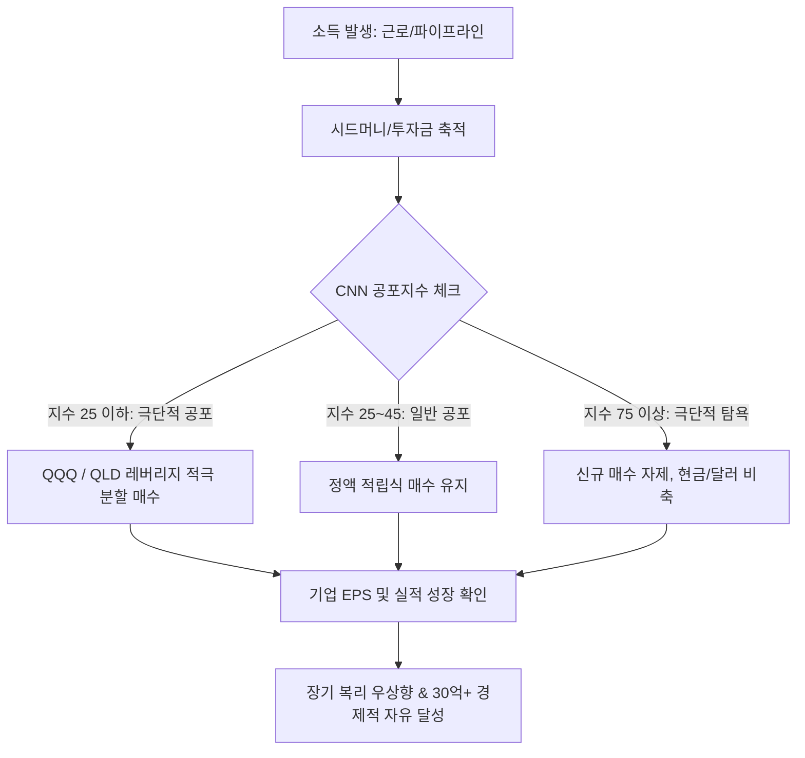

# 🧭 06. 월가 핵심 지표 & 시장 심리 분석 가이드 (Market Indicators)

> **"남들이 탐욕스러울 때 두려워하고, 남들이 두려워할 때 탐욕을 부려라."** - 워런 버핏

시장 참여자들의 감정(공포와 탐욕)과 거시경제 건전성을 객관적인 수치로 파악하여 **'하락장 분할 매수'**와 **'과열장 현금 확보'**의 타이밍을 잡는 핵심 지표 가이드입니다.

---

## 1. CNN 공포 & 탐욕 지수 (CNN Fear & Greed Index)

### 📌 개념
- CNN Business에서 매일 발표하는 미국 주식 시장의 심리 지표 (0점 ~ 100점).
- **0 ~ 25**: 극단적 공포 (Extreme Fear) ➡️ **최고의 분할 매수 기회 (바겐세일)**
- **26 ~ 44**: 공포 (Fear) ➡️ 분할 매수 구간
- **45 ~ 55**: 중립 (Neutral)
- **56 ~ 74**: 탐욕 (Greed) ➡️ 관망 또는 적립 유지
- **75 ~ 100**: 극단적 탐욕 (Extreme Greed) ➡️ **과열 구간 (현금 비중 확대 / 리밸런싱 검토)**

### 📊 7대 세부 구성 지표
1. **시장 모멘텀 (Market Momentum)**: S&P 500 지수와 125일 이동평균선 간의 이격도
2. **주가 강도 (Stock Price Strength)**: 52주 신고가 종목 수 vs 신저가 종목 수
3. **주가 폭 (Stock Price Breadth)**: 상승 종목의 거래량 vs 하락 종목의 거래량 (McClellan Volume Summation Index)
4. **풋/콜 옵션 비율 (Put and Call Options)**: 하락 베팅(Put) 대비 상승 베팅(Call)의 5일 이동평균
5. **시장 변동성 (Market Volatility)**: VIX 지수 및 50일 이동평균선과의 괴리
6. **안전자산 수요 (Safe Haven Demand)**: 주식 수익률 대비 국채 수익률 (지난 20영업일)
7. **정크본드 수요 (Junk Bond Demand)**: 투자등급 채권과 하이일드(정크) 채권 간의 스프레드(금리 차이)

### 🔗 확인처 및 주기
- **조회 URL**: [CNN Fear & Greed Index 공식 사이트](https://edition.cnn.com/markets/fear-and-greed)
- **업데이트 주기**: **실시간 (미국 증시 개장 중 갱신, 매일 장 마감 후 최종 집계)**
- **확인 추천 시간**: 한국 시간 기준 밤 11시 30분 ~ 익일 아침 7시 (서머타임 시 밤 10시 30분 ~ 아침 6시)

---

## 2. 월가 필수 거시/심리 5대 지표 총정리

| 지표명 | 핵심 의미 | 어디서 보나? (URL) | 산출/발표 주기 | 실전 부자 투자 활용법 |
| :--- | :--- | :--- | :--- | :--- |
| **VIX (변동성 지수, '공포 지수')** | S&P 500 옵션 가격 기반 향후 30일 변동성 기대치 | [Investing.com VIX](https://kr.investing.com/indices/volatility-s-p-500) 또는 TradingView `VIX` | **실시간** (미국 장중) | • 20 이하: 평온한 상승장 • 30 돌파: 시장 패닉 (분할 매수 시작) • 40~50 이상: 역사적 대바닥 (적극 매수) |
| **풋/콜 비율 (Put/Call Ratio)** | 하락에 거는 풋옵션 거래량 ÷ 상승에 거는 콜옵션 거래량 | [CBOE 공식 Total Put/Call](https://www.cboe.com/us/options/market_statistics/daily/) 또는 Barchart | **매일 장 마감 후** | • 1.0 초과: 하락 공포 심화 (반등 신호) • 0.7 미만: 시장 과열/낙관 (고점 경계) |
| **버핏 지수 (Buffett Indicator)** | 미국 전체 주식 시가총액 ÷ 미국 GDP | [Current Market Valuation](https://www.currentmarketvaluation.com/models/buffett-indicator.php) | **분기별** (GDP 발표 시 갱신) | • 100% 이하: 저평가 • 150%~180%: 적정/경계 • 200% 초과: 역사적 고평가 (현금 비중 확보) |
| **하이일드 스프레드 (High Yield Spread)** | 위험 부실기업 채권 금리 - 안전 국채 금리 차이 | [FRED (세인트루이스 연은) BAMLH0A0HYM2](https://fred.stlouisfed.org/series/BAMLH0A0HYM2) | **매일 (1일 시차)** | • 스프레드 급등(6~10%p+): 신용 위기/부도 위험 경보 • 스프레드 안정(3~4%p): 유동성 풍부 |
| **CME FedWatch (연준 금리 예측)** | 연준(Fed)의 다음 FOMC 기준금리 인상/인하 확률 | [CME FedWatch Tool](https://www.cmegroup.com/markets/interest-rates/cme-fedwatch-tool.html) | **실시간** (연방기금선물 기반) | • 금리 인하 기대감 형성 시 성장주(나스닥/QQQ/QLD) 수혜 • FOMC 회의 주기(연 8회) |

---

## 3. 손주부(30억 파이어족) 영상 기반 실전 투자 공식

1. **지수 ETF 중심의 안전성 확보**: 개별 종목의 파산 리스크를 제거하고 미국 1등 기업 100개를 담은 **QQQ**와 변동성을 이용한 **QLD(2배 레버리지)**를 적절히 배분.
2. **감정이 아닌 '지표' 기반 기계적 매수**: 폭락 뉴스에 공포를 느끼는 대신 **CNN 공포지수 20~25 이하**를 확인하고 기계적으로 매수 버튼을 누름.
3. **기업 순이익(EPS) 확인**: 단기 주가 출렁임에 일희일비하지 않고 S&P 500 및 빅테크 기업들의 **순이익 성장 전망치**가 우상향하는지 팩트 체크.
