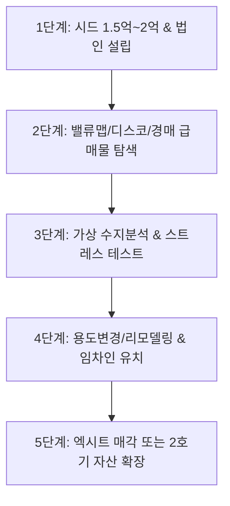

# 🏢 08. 소액 꼬마빌딩 밸류애드(Value-Add) & 부동산 레버리지 전략

> **"월세를 내는 자영업자는 건물주의 이자를 갚아주는 사람이고, 내 건물을 가진 자영업자는 미래의 부를 축적하는 사람이다."** - 장사건물주 강호동

---

## 1. 꼬마빌딩 레버리지 매입 공식 (Theory)

```
[총 매매가 (예: 10억원)]
  ├── 은행 담보대출 (70~80%): 7억 ~ 8억원
  ├── 기존 임차인 보증금: 1억원
  └── 실투자금 (순수 내 돈): 1억 ~ 2억원
```

### 💡 밸류애드(Value-Add)의 핵심 원리
1. **저평가된 노후 부동산 매입**: 낡은 단독주택, 여관/모텔, 구옥 상가를 시세 대비 저렴하게 매입.
2. **용도변경 & 리모델링**: 주택 ➡️ 근린생활시설(상가)로 용도변경, 내외관 트렌디한 리모델링.
3. **앵커 테넌트(Anchor Tenant) 입점**: 핫플 F&B, 감성 카페, 공유 오피스, 공간 대여 업종 입점으로 월 임대료 대폭 인상.
4. **건물 가치 재평가**: 상업용 부동산의 가격은 `임대료 ÷ 자본환원율(Cap Rate)`로 결정되므로, 임대료가 2배 오르면 건물 가치도 1.5~2배 급등 ➡️ 매각 차익(Capital Gain) 실현 또는 추가 대출(Refinancing)로 2호기 확장.

---

## 2. 현실 가능성 팩트체크 & 리스크 분석 (Reality Check)

### ✅ 가능한 이유 (장점)
- **주택 대비 대출 규제 완화**: 상가/토지는 주택의 강력한 LTV/DSR 규제 대신 RTI(임대업이자상환비율)가 적용되며, 법인을 활용할 경우 70~80% 대출 가능.
- **토지 지가 상승**: 건물은 감가상각되지만 입지가 좋은 도심지의 '토지(땅값)'는 인플레이션과 함께 영구 우상향.

### ⚠️ 현실적 장벽과 위험 요인 (반드시 알아야 할 리스크)
1. **금리 부담과 역마진 (Negative Carry)**:
   - 8억 대출 시 금리 5.5% 적용 시 **월 이자만 366만원**.
   - 월세 수입이 이자보다 적거나 공실이 발생하면 매달 수백만원의 생돈을 메워야 하는 '하우스푸어/빌딩푸어' 전락 위험.
2. **취등록세 및 부대비용 간과**:
   - 상가 취득세율 4.6% + 중개수수료 + 법무비 + 리모델링 계약금 등 10억 건물 기준 **최소 6,000만~1억원의 부대비용** 별도 필요 (실투자금 1억만으로는 부족할 수 있음).
3. **'장사/기획 능력'의 부재**:
   - 강호동 대표는 본인이 '라라브레드' 등 유명 브랜드를 만들어 공실을 채울 능력이 있었음. 브랜딩 능력이 없는 일반인은 공실 리스크에 노출됨.

---

## 3. 실전 5단계 실행 로드맵 (Action Plan)



### [1단계] 종잣돈 확보 & 신용/법인 세팅
- 최소 실투자금 **1.5억 ~ 2억원** 확보 (매입금 1억 + 취등록세/부대비용 5천만 + 6개월분 이자 예비비).
- 부동산 매매/임대 법인 설립 검토 (비용 처리 및 대출 유연성).

### [2단계] 타깃 물건 탐색 (현장 임장 & 앱 활용)
- **필수 앱**: [밸류맵](https://www.valueupmap.com), [디스코](https://www.disco.re), [네이버 부동산](https://land.naver.com), [대법원 경매정보](https://www.courtauction.go.kr).
- **타깃**: 역세권 배후지, 2종/3종 일반주거지역의 대지면적 25~40평 내외 노후 단독주택/상가주택.

### [3단계] 수지분석 (스트레스 테스트)
- `예상 월 임대료(또는 자가매장 영업이익) > 대출 월 이자(금리 6% 가정)` 공식 만족 여부 철저히 검증.

### [4단계] 건축사 상담 및 밸류애드 공사
- 매입 전 건축사를 통해 정화조 용량, 주차장 규정, 일조권 사선제한, 상가 용도변경 가능 여부 확인.
- 트렌디한 화이트톤/노출콘크리트 외관 리모델링 및 1층 근린생활시설 조성.

### [5단계] 임대차 계약 및 수익 실현
- 프랜차이즈, 공방, 미용실, 스튜디오 등 우량 임차인 세팅 후 시세 차익 실현 또는 장기 배당 자산화.
