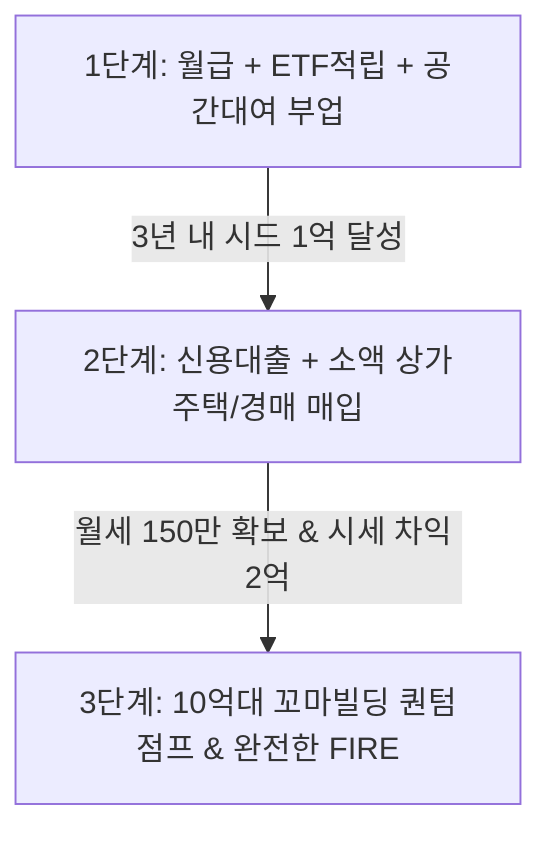

# 👔 09. 일반 회사원/직장인을 위한 실전 부자 전략 (Office Worker Blueprint)

> **"직장인의 '매달 꼬박꼬박 들어오는 월급'과 '신용'은 자영업자나 전업 투자자가 결코 가질 수 없는 가장 강력한 자본주의의 무기다."**

---

## 1. 회사원이 가진 3대 치트키 (The Unfair Advantage)

1. **안정적인 현금흐름 (Cashflow Buffer)**:
   - 자영업자는 불경기에 월세와 알바비가 안 나와 이자를 못 내면 파산하지만, 직장인은 **월급이 안전판** 역할을 하므로 하락장과 공실을 버텨낼 수 있습니다.
2. **금융권 최고의 신용도 (Credit Leverage)**:
   - 은행은 매출이 불안정한 사업자보다 **따박따박 원천징수되는 직장인의 대출 한도와 금리**를 가장 우대합니다 (직장인 신용대출, 마이너스 통장).
3. **시간 레버리지 시스템 구축 가능**:
   - 풀타임으로 매달려야 하는 자영업과 달리, 직장인은 **"하루 5분 자동화 투자 + 무인 시스템 + 위탁 운영"** 구조를 짜면 본업과 자산 성장을 동시에 굴릴 수 있습니다.

---

## 2. '장사건물주 강호동TV' 채널 기반 직장인 실전 4대 모델

```
[직장인 부의 4대 파이프라인]
├── 1. [시간 0분] 미국 지수 ETF 적립 & 라오어 무한매수법 (금융 복리)
├── 2. [주말 2시간] 무인 공간대여 & 전대차 비즈니스 (월 100~300만 부수입)
├── 3. [신용 레버리지] 직장인 법인 설립 & 수도권 꼬마 상가주택/경매 매입
└── 4. [무자본 지식] 회사 직무 노하우 전자책/템플릿 디지털 자산화
```

---

### [모델 1] 시간 0분: 미국 지수 ETF 적립 & 라오어 무한매수법
- **대상**: 야근과 업무로 주식창을 볼 틈이 없는 직장인
- **실행법**:
  - **코어 자산 (70%)**: 월급날 나스닥100(QQQ), 배당성장(SCHD), S&P500 기계적 자동이체 매수
  - **알파 자산 (30%)**: 라오어 무한매수법 (낮에 5분 스마트폰으로 TQQQ 40분할 LOC 예약 주문)
  - CNN 공포지수 25 이하 알람이 올 때만 상여금/보너스 집중 투입

---

### [모델 2] 주말 2시간: 무인 공간대여 & 전대차 (전대 건물주)
- **개념**: 건물을 사지 않고도 남의 건물을 임차(월세)하여 **파티룸, 스터디룸, 촬영 스튜디오, 무인 공유창고**로 운영.
- **필요 자본**: 보증금 1,000만 ~ 2,000만원 + 인테리어 1,000만원 = **총 2,000만~3,000만원 소자본**.
- **직장인 운영 방식**:
  - 예약 및 결제: 네이버 예약 / 스페이스클라우드 자동화
  - 출입 관리: 스마트 도어락 비밀번호 자동 전송
  - 청소 관리: 숨고 / 크린벨 등 청소 도우미 위탁 (건당 1~2만원)
  - **수익**: 월세/관리비/위탁비 제외 **월 80만 ~ 200만원 순수익 발생**.
  - ➡️ 이 부수입을 모아 진짜 건물주 시드머니로 투입!

---

### [모델 3] 직장인 신용 레버리지: 수도권 소액 꼬마 상가주택 / 경매
- **개념**: 서울 강남의 50억~100억 빌딩이 아닌, **수도권 역세권 3억~5억원대 소형 상가주택/근린상가** 타깃.
- **자금 조달 공식 (예: 4억원 상가주택)**:
  - 감정가 담보대출 (70%): 2.8억원
  - 3층 주택 전세 보증금: 8,000만원
  - 1층 상가 임대 보증금: 2,000만원
  - **순수 실투자금: 2,000만원 ~ 5,000만원** (직장인 신용대출 또는 마이너스 통장으로 커버 가능!)
- **운영 팁**: 직장 겸업 금지 조항을 피하기 위해 **배우자 명의 또는 가족 공동 법인**으로 취득.

---

### [모델 4] 무자본 지식 디지털 상품화 (Productize Yourself)
- **개념**: 내가 회사에서 겪은 문제 해결 과정(기획서 양식, 엑셀 함수 템플릿, 업무 자동화 파이썬 스크립트, 이직 포트폴리오)을 정리.
- **판매처**: 크몽, 탈잉, 와디즈, 노션 템플릿 마켓.
- **장점**: 원가 0원, 재고 0개, 한 번 만들어두면 퇴근 후 자는 동안에도 순이익 입금.

---

## 3. 일반 회사원의 3단계 현실적 부자 로드맵



1. **1단계 (시드 1억 만들기 / 1~3년차)**:
   - 월급 저축(150만) + 무한매수/ETF 복리 수익 + 공간대여 부업(월 100만) = **연 3,000만~4,000만원 순축적** ➡️ 3년 내 시드 1억원 돌파.
2. **2단계 (첫 꼬마 상가주택 매입 / 3~5년차)**:
   - 모은 1억 + 직장인 신용대출로 수도권 4억~5억 상가주택 매입 ➡️ 월세 현금흐름 150만원 추가 확보.
3. **3단계 (밸류애드 & 꼬마빌딩 퀀텀점프 / 5년차 이후)**:
   - 1단계 금융 자산 + 2단계 부동산 가치 상승분(시세 차익)을 합쳐 **10억~20억대 정식 꼬마빌딩 매입 ➡️ 직장 졸업 (FIRE)**.
