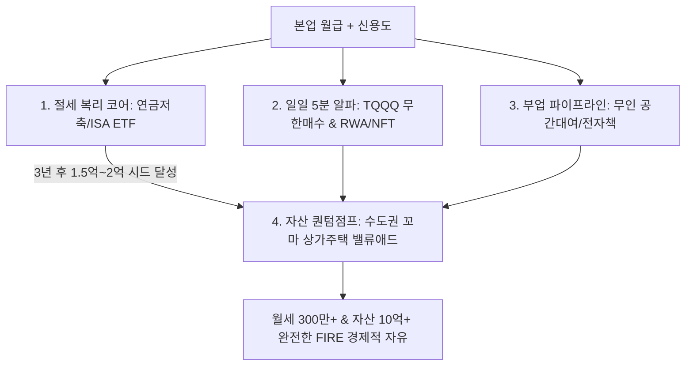

# 👑 13. [통합 제안] 지금까지의 모든 학습을 집대성한 맞춤형 부자 마스터플랜

> **"우리가 지금까지 학습한 7가지 무기는 파편화된 조언이 아닙니다. 완벽하게 맞물려 돌아가는 하나의 '자산 증식 자동화 머신'입니다."**

---

## 🧭 부의 3단계 통합 로드맵 요약

---

## 🎯 사용자님을 위한 4대 핵심 제안 (Action Blueprint)

### 제안 1. [내일 당장 시작] 100% 비과세/절세 3계좌 자동화 세팅
1. **연금저축펀드 (월 50만원 자동이체)**:
   - `TIGER 미국S&P500` (40%) + `TIGER 미국나스닥100` (30%) + `SOL 미국배당다우존스` (30%)
   - **효과**: 연말정산 시 **연 최대 99만원 세금 환급** ➡️ 배당금과 환급금 전액 재투자.
2. **ISA 중개형 계좌 (월 30만~50만원 적립)**:
   - `TIGER 미국배당+7%프리미엄다우존스` + `TIGER 미국30년국채+12%프리미엄`
   - **효과**: 매월 통장에 꽂히는 월배당 현금흐름 체감 + 3년 만기 시 연금저축 전환으로 **10%(최대 300만원) 추가 세액공제 치트키**.

---

### 제안 2. [하루 5분] 라오어 무한매수법 & 시장 공포지수 활용
1. **TQQQ 40분할 무한매수 (알파 계좌)**:
   - 여유 자금 500만~1,000만원을 40회분(회당 12.5만~25만원)으로 나누어, 낮에 스마트폰으로 LOC 예약 매수.
   - 평단가 +10% 수익 시 전량 익절하여 확정 수익 복리 회수.
2. **CNN 공포지수 25 이하 역발상 매수 (손주부 공식)**:
   - 공포지수가 25 이하(극단적 공포)로 떨어질 때만 모아둔 비상금/상여금으로 `QQQ / QLD` 바겐세일 추가 매수.

---

### 제안 3. [웹3 미래 혁신] RWA & NFT 독점 인프라 10% 분할 적립
- **원칙**: 업비트 원화 마켓에서 실질 수익(Real Yield)과 독점 인프라를 가진 종목만 10% 비중 매수.
- **종목**:
  - `LINK (체인링크)`: SWIFT 등 전통 금융망 연결 RWA 독점 인프라
  - `RENDER (렌더)`: 애플 및 AI/3D 메타버스 렌더링 GPU 독점
  - `IMX (이뮤터블X)`: 가스비 0원 대작 웹3 게이밍 L2
  - `MKR (메이커다오)`: 실제 미국 국채 보유 1위 디파이

---

### 제안 4. [3년 후 목표] 수도권 꼬마 상가주택 밸류애드 & 건물주 진입
1. **목표 시드**: 금융 자산으로 3년 내 **1.5억 ~ 2억원** 확보.
2. **실행**:
   - 직장인 신용대출 + 가족 법인 70% 담보대출 활용하여 수도권 역세권 4억~5억원대 낡은 상가주택/구옥 경매 매입.
   - 1층 상가 용도변경 및 트렌디한 리모델링(Value-Add)으로 임대료 2배 인상.
   - ➡️ **월세 현금흐름 200만~300만원 확보 + 사표 던지고 FIRE 달성!**
