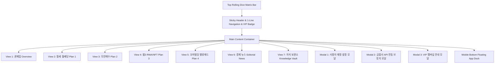

# 📱 부의 나침반 (Wealth Compass Pro) - 화면 정의서 (UI/UX Specification)

> **문서 버전**: v1.0.0  
> **최종 수정일**: 2026-09-01  
> **시스템 명칭**: Wealth Compass Pro User Interface Specification  
> **문서 목적**: 전체 7개 뷰 화면 구성, 컴포넌트 계층, 반응형 인터랙션 및 모달 명세 정의

---

## 1. 전체 화면 구조도 (View Architecture)

---

## 2. 7대 뷰 상세 명세 (Detailed View Specifications)

### 2.1 Top Global Rolling Dice Bar (`#slider-us`, `#slider-kr`, `#slider-web3`)
- **위치**: 페이지 최상단 고정 스트립
- **구성요소**:
  - `LIVE MATRIX` 펄스 인디케이터
  - `USD/KRW` 고정 실시간 환율 박스 (140px 고정)
  - **Slot 1 (US ETF)**: 나스닥, S&P500, TQQQ, SCHD, QLD, TLT
  - **Slot 2 (KR 월배당)**: SOL미국배당, TIGER미국배당+7%, TIGER30년국채, TIGER S&P500, TIGER 나스닥100
  - **Slot 3 (Web3 RWA)**: LINK, ONDO, RENDER, IMX, PENDLE, OM
- **인터랙션**: 4초 간격 Staggered (1.3s 오프셋) 0.65s 부드러운 수직 롤링 슬라이드 & 상승(Green)/하락(Red) 플래시 FX.

### 2.2 메인 뷰 1: 종합 관제탑 (`#view-overview`)
- **A. 상단 Hero & 개인화 재정 요약**: 사용자 닉네임, 현재 시드, 목표 시드 달성률 프로그레스 바.
- **B. AI 맞춤 당일 실전 투자 오더 브리핑 (`#ai-action-order-hub`)**:
  - TQQQ 40분할 1회차 주문액 및 평단가 LOC/현재가+5% LOC 지정가 동적 산출
  - 이번 달 SOL 미국배당 월적립액 및 예상 월배당
  - 웹3 RWA 이번 주 1순위 분할매수 종목 (LINK, ONDO)
  - 버핏 바겐세일 대기 신호 (공포 25 이하 조건)
- **C. 월가 심리 지표 듀얼 게이지**: CNN 주식 공포지수 & 가상자산 공포지수 원클릭 탭 전환.
- **D. 월가 3대 거장 레이더 (13F Radar)**: 버핏(현금 방패), 달리오(70:20:10 분산), 드라켄밀러(AI 인프라 독점) 포지션.
- **E. 4대 핵심 전략 요약 카드 및 70:20:10 자산배분 도넛 차트**.

### 2.3 메인 뷰 2: 절세 코어 & 월배당 포트폴리오 (`#view-plan1`)
- **A. 연금저축/IRP 세액공제 시뮬레이터**: 월 납입액 슬라이더 ➔ 연말정산 환급금 즉시 산출.
- **B. 월배당 ETF 15년 복리 성장 인터랙티브 차트**: 월 예상 배당금 추이 선그래프.

### 2.4 메인 뷰 3: 5분 무한매수 알파 엔진 (`#view-plan2`)
- **TQQQ 40분할 매수 계산기**: 시드, 평단가, 현재가 입력 ➔ 1회차 매수금액, LOC 1/2차 주문가, +10% 익절가 산출.

### 2.5 메인 뷰 4: 웹3 RWA & NFT 독점 인프라 (`#view-plan3`)
- **실시간 코인 시세 그리드**: LINK, ONDO, RENDER, IMX 실시간 가격 및 24시간 변동률.

### 2.6 메인 뷰 5: 소액 꼬마빌딩 밸류애드 & FIRE (`#view-plan4`)
- **꼬마빌딩 레버리지 계산기**: 매매가, 대출 비율(70%), 금리(5.5%), 임대료 입력 ➔ 순 월세 현금흐름 산출.

### 2.7 메인 뷰 6: 글로벌 경제 뉴스 & 에디토리얼 (`#view-news`)
- **A. 실시간 날짜 동기화 헤더 & 속보 마키 스트립**
- **B. 5개 카테고리 필터**: 전체, 연준/거시, 미국주식/배당, 웹3/RWA, 부동산/금리
- **C. 1면 특종 (Front-Page Lead Story)**: 블룸버그 & WSJ 종합 분석 + 한국어 3줄 브리핑
- **D. 6대 글로벌 언론사 에디토리얼 그리드** & 글로벌 경제 캘린더.

### 2.8 메인 뷰 7: 부의 지식 보관소 (`#view-vault`)
- 좌측 10대 핵심 지식 문서 목차 버튼 & 우측 마크다운 뷰어 영역.

---

## 3. 모달 & 모바일 도크 명세

### 3.1 사용자 재정 설정 모달 (`#user-settings-modal`)
- **3대 프리셋 버튼**: [2030 사회초년생], [3040 정석 직장인], [FIRE 조기은퇴 가속자]
- 저장 시 전체 7개 화면의 데이터 및 차트, AI 오더 수치 실시간 재계산 & 로컬 저장.

### 3.2 금융사 API 연동 브릿지 모달 (`#api-bridge-modal`)
- 한국투자증권 Open API & 업비트 Open API 연동 가이드 및 [원클릭 모의 잔고 동기화] 버튼.

### 3.3 VIP 멤버십 모달 (`#membership-modal`)
- Basic(무료), Pro(월 1.9만), VIP Family Office(월 9.9만) 3단계 SaaS 등급 안내.

### 3.4 모바일 하단 플로팅 네이티브 앱 도크 (`#mobile-bottom-dock`)
- 모바일 해상도(`md:hidden`)에서 화면 하단 고정.
- [관제탑] [월배당] [무한매수] [웹3] [경제뉴스] [지식] 6개 퀵 탭 전환 지원.
