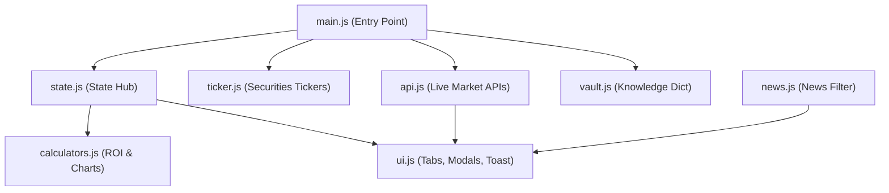

# 🛠️ 부의 나침반 (Wealth Compass Pro) - 모듈 구조도 및 유지보수 가이드 (Maintenance Guide)

> **문서 버전**: v1.0.0  
> **최종 수정일**: 2026-09-01  
> **시스템 명칭**: Modular Maintenance & Architecture Guide  
> **문서 목적**: 디렉토리 구조, 모듈 간 의존성 관계, 코드 규칙 및 지속적 유지보수 가이드 정의

---

## 1. 프로젝트 디렉토리 구조 (Directory Hierarchy)

```text
f:\AI\부자\
├── index.html                      # 루트 호스팅용 웹 진입점 (GitHub Pages / Vercel 배포용)
├── app/
│   ├── index.html                  # 메인 앱 마크업 진입점
│   ├── css/
│   │   └── style.css               # 전역 스타일, Glassmorphism, 롤링 슬라이더 애니메이션
│   └── js/
│       ├── ticker.js               # 3-슬롯 증권사급 롤링 다이스 캐러셀 엔진
│       ├── state.js                # 사용자 프로필 상태 관리 및 UI 동기화 엔진
│       ├── api.js                  # 실시간 환율/코인/공포지수 API 연동 및 KIS/Upbit 모달
│       ├── calculators.js          # 절세/월배당/무한매수/꼬마빌딩 4대 계산기 및 차트
│       ├── ui.js                   # 탭 전환, 토스트 알림, 컨페티, 모달 제어
│       ├── news.js                 # 경제 뉴스 카테고리 필터링 및 에디토리얼 피드
│       ├── vault.js                # 지식 보관소 문서 딕셔너리 및 마크다운 렌더러
│       └── main.js                 # 앱 초기화 및 생명주기 오케스트레이터
├── css/                            # 루트 배포용 미러 디렉토리
├── js/                             # 루트 배포용 미러 디렉토리
├── 산출물/                         # 공식 시스템 산출물 명세서
│   ├── 01_프로그램_정의서_PROGRAM_SPECIFICATION.md
│   ├── 02_화면_정의서_UI_UX_SPECIFICATION.md
│   ├── 03_모듈_구조도_및_유지보수_가이드_MAINTENANCE_GUIDE.md
│   └── 04_데이터_및_API_연동_명세서_API_SPECIFICATION.md
├── docs/                           # 영구 부의 지식 보관소 & 진화 이력
│   ├── 14_WALL_STREET_TRINITY_AI_STRATEGY.md
│   ├── 15_ALL_IN_ONE_MOBILE_MEMBERSHIP_BLUEPRINT.md
│   ├── history/                    # Level 01 ~ Level 20 진화 로그
│   └── wealth_vault/               # 13대 부자 지식 문서
└── README.md                       # 프로젝트 소개 및 실행 가이드
```

---

## 2. 자바스크립트 모듈 의존성 그래프 (Module Dependency Graph)



---

## 3. 모듈별 책임 및 역할 (Module Responsibilities)

| 모듈 파일명 | 주요 함수 / 객체 | 주요 책임 및 역할 |
|---|---|---|
| `state.js` | `userProfile`, `loadUserProfile()`, `saveUserProfileSettings()`, `syncUserProfileToUI()` | 사용자 자산/연봉/비율 상태 관리, LocalStorage 영구 저장 및 전체 화면 DOM 텍스트 실시간 재계산 |
| `ticker.js` | `DICE_DATA`, `slideTickerSlot()`, `startStaggeredSecuritiesTickers()` | 상단 3개 슬롯(미국주식/월배당/웹3)의 4초 간격 스태거드 롤링 슬라이드 제어 |
| `api.js` | `refreshAllRealtimeData()`, `toggleFngTab()`, `runMockApiSync()`, `saveAndSyncOpenApi()` | 환율, 코인, CNN 공포지수 API 수신 및 DOM 업데이트, 금융사 Open API 브릿지 제어 |
| `calculators.js` | `calcTaxRefundPro()`, `calcMonthlyDividend()`, `calcInfinitePro()`, `calcBuildingPro()`, `renderDividendChart()`, `renderOverviewChart()` | 세액공제, 월배당 복리 차트, TQQQ 40분할 LOC 주문가, 꼬마빌딩 레버리지 현금흐름 산출 |
| `ui.js` | `switchTab()`, `showToast()`, `triggerConfetti()`, `openUserSettingsModal()`, `openMembershipModal()` | 화면 탭 전환, 토스트 팝업, 축하 효과, 설정 및 멤버십 모달 여닫기 |
| `news.js` | `filterNewsCategory()` | 경제 뉴스 카테고리(거시, 주식, 웹3, 부동산) 실시간 필터링 |
| `vault.js` | `vaultDocs`, `displayDoc()` | 10대 핵심 지식 문서 딕셔너리 보관 및 마크다운 본문 동적 렌더링 |
| `main.js` | `DOMContentLoaded` | Lucide 아이콘 렌더링 및 모듈 초기 구동 순서 오케스트레이션 |

---

## 4. 유지보수 및 코드 수정 가이드 (Maintenance Conventions)

### 4.1 새로운 지식 문서 추가 시
1. `app/js/vault.js`의 `vaultDocs` 객체에 신규 키 및 `{ title: '...', content: '...' }` 추가.
2. `app/index.html`의 `#view-vault` 좌측 목차에 `<button onclick="displayDoc('신규키')">` 버튼 추가.
3. `f:\AI\부자\docs\wealth_vault\` 또는 `docs/`에 마크다운 문서 생성.

### 4.2 새로운 시세 종목 추가 시
1. `app/js/ticker.js`의 `DICE_DATA` 객체 내 해당 슬롯 배열(`us`, `kr`, `web3`)에 `{ name: '...', price: '...', chg: '...' }` 추가.
2. 브라우저 새로고침 시 롤링 캐러셀에 자동 순환 반영됨.

### 4.3 배포 및 동기화 규칙
- `app/` 내부 파일(`app/index.html`, `app/css/`, `app/js/`) 수정 후, 반드시 루트 디렉토리(`index.html`, `css/`, `js/`)에 동일하게 복사 반영한 뒤 `git commit` 및 `git push`를 수행합니다.
